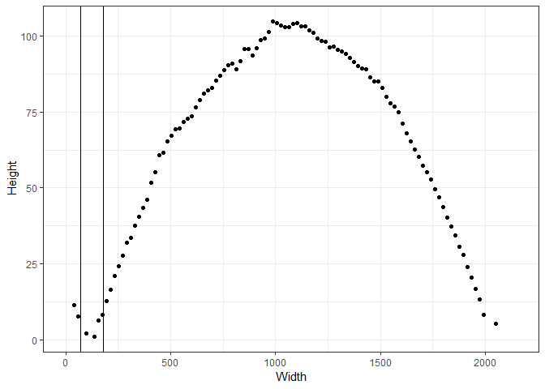

<!-- README.md is generated from README.Rmd. Please edit that file -->
bulletcp
========

The goal of 'bulletcp' is to easily automate the identification of groove locations via a Bayesian changepoint model on data which are 2D crossections of 3D bullet land scans. Ultimately, this package will potentially support other packages implementing automated bullet land matching algorithms for use by forensic scientists or statisticians. The only function that should ideally be used by a user or another function is `get_grooves_bcp()`, which takes minimal arguments (though several optional arguments can be supplied) and returns a list. Of the items in the list, the only one that should ideally be needed by anyone is the one called "groove": a two element vector of estimated groove locations.

Installation
------------

You can install the released version of 'bulletcp' from [CRAN](https://CRAN.R-project.org) with:

``` r
install.packages("bulletcp")
```

Example
-------

The ideal usage of the package is now demonstrated on the example data included. First, we show what the data should look like.

``` r
library(bulletcp)
#> Loading required package: mvtnorm
#> Loading required package: dplyr
#> 
#> Attaching package: 'dplyr'
#> The following objects are masked from 'package:stats':
#> 
#>     filter, lag
#> The following objects are masked from 'package:base':
#> 
#>     intersect, setdiff, setequal, union
#> Loading required package: assertthat
library(ggplot2)

data("example_data")
head(example_data)
#>       x value
#> 1 0.000    NA
#> 2 0.645    NA
#> 3 1.290    NA
#> 4 1.935    NA
#> 5 2.580    NA
#> 6 3.225    NA

ggplot(data = example_data) +
  geom_point(aes(x = x, y = value)) +
  theme_bw() +
  ylab("Height") +
  xlab("Width")
#> Warning: Removed 323 rows containing missing values (geom_point).
```


Next, we use the `get_grooves_bcp()` function on the raw data to get the groove locations. Downsampled data are used here for speed, but in practice the full data should be used.

``` r
# Estimate the groove locations by supplying additional arguments 
example_data <- example_data[seq(from = 1, to = nrow(example_data), by = 30),]
cp_gibbs <- get_grooves_bcp(x = example_data$x, value = example_data$value, adjust = 30, iter = 2000)

# Estimated groove locations
cp_gibbs$groove
#> [1]  68.7000 178.0647

ggplot(data = example_data) +
  geom_point(aes(x = x, y = value)) +
  theme_bw() +
  ylab("Height") +
  xlab("Width") +
  geom_vline(aes(xintercept = cp_gibbs$groove[1])) +
  geom_vline(aes(xintercept = cp_gibbs$groove[2]))
#> Warning: Removed 11 rows containing missing values (geom_point).
```


